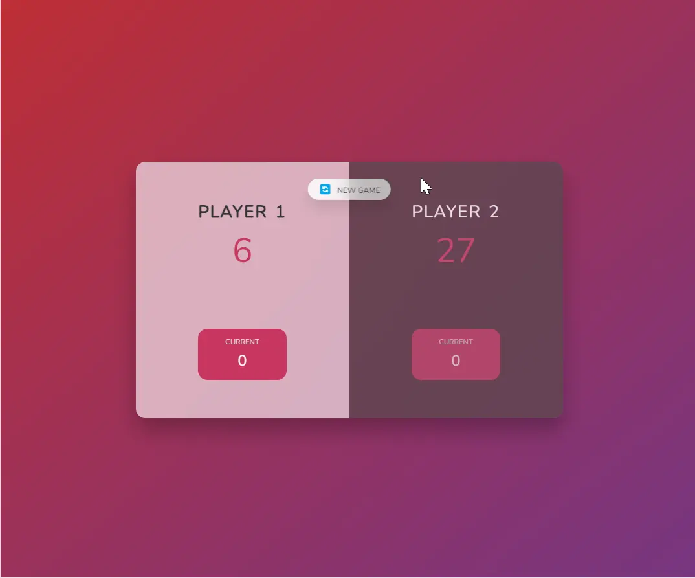

### 👋 **I am Erhan ERTEM**

&emsp;

## Udemy The Complete JavaScript Course 2022 From Zero to Expert! by Jonas Schmedtmann

### **Objective:** Create a browser-based two-player game called 'Pig-Game'

- Get into programming algorithm and logic diagram
- Implement JavaScript DOM and Events fundamentals
- Beyond the curriculum of the task:
  - Employ multiline CSS style injection
  - Add blinking CSS animation for the winner
  - Hide/unhide dice and hold button when required throughout the game
  - Made responsive for tablet and phones for landscape and portrait viewing

&emsp;

#### [Pig-Game](https://pig-game-erhan-ertem.netlify.app)

---

  
